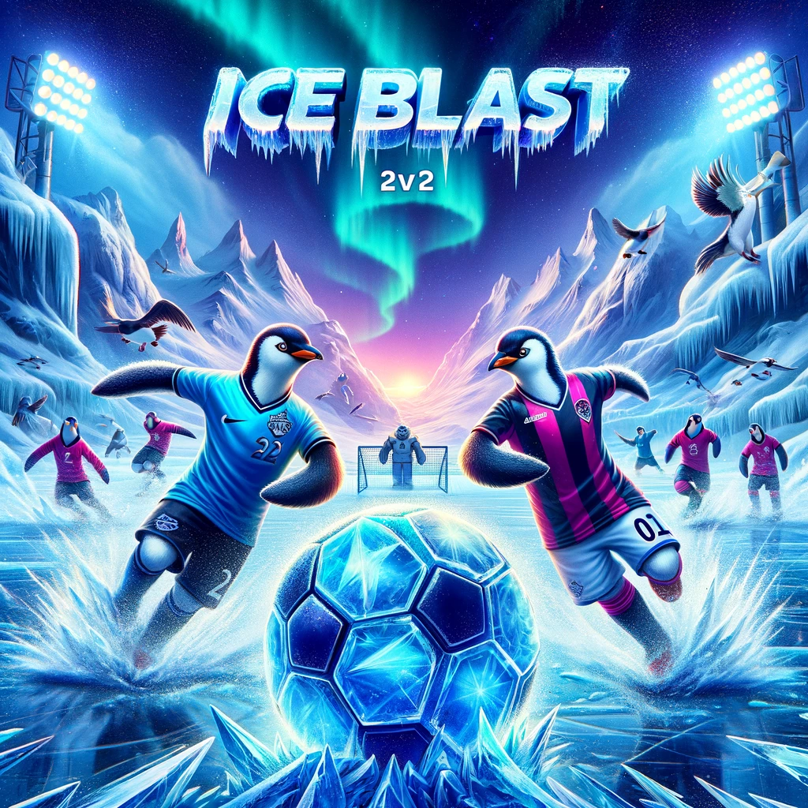
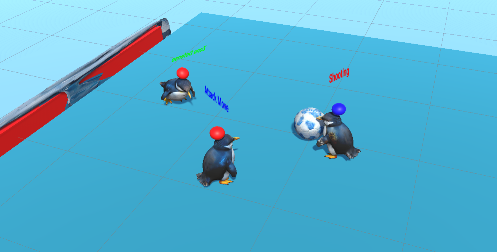

# IceBlast

IceBlast is a thrilling 3D mini game developed using Unity 2019.4.0f1. It brings the excitement of a fast-paced, icy soccer match to your screen!

## Gameplay

In IceBlast, two teams of two adorable penguins face off against each other in a chilly arena. The objective is simple: kick the ball into the opposing team's goal to score points. However, the slippery ice surface adds an extra level of challenge and unpredictability to the game.

The penguins are controlled by a sophisticated heuristic AI that determines their behavior based on their assigned roles and the current game state. The AI takes into account factors such as the position of the ball, the location of the goals, and the presence of teammates and opponents. This results in dynamic and engaging gameplay, as the penguins intelligently navigate the rink, pass the ball to their teammates, and take shots at the goal.

## Features

- **Realistic Ice Physics**: Experience the thrill of playing on a slippery ice surface that affects the movement and control of the penguins and the ball.
- **Smart AI Opponents**: Compete against intelligent penguin AIs that adapt their strategies based on the game situation.
- **Multiple Roles**: Each penguin has a specific role, such as attacking or defending, which determines their behavior on the rink.
- **Interactive Environment**: Penguins can collide with each other and the ball, adding an extra layer of realism and challenge to the gameplay.